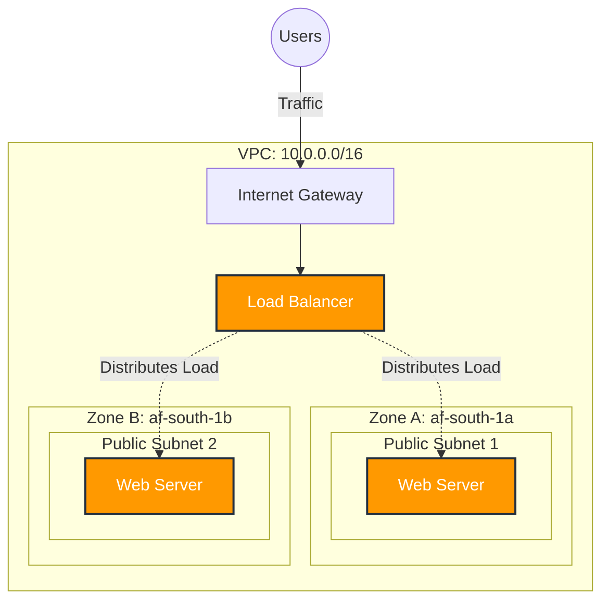

# Static

### High-Availability "Self-Healing" Web Architecture:

**The Problem:**
Living in South Africa, we often hear "System Offline" at government institutions like Home Affairs. This usually happens because legacy systems have a "Single Point of Failure", if one server crashes, the whole service stops.

**The Solution:**
Static is a **self-healing** infrastructure built on AWS. It uses an **Auto Scaling Group** to monitor servers. If a server crashes or goes offline, the system automatically detects it, terminates it, and launches a fresh replacement instantly. No human intervention needed.

---

### Tech Stack:

- **Cloud:** AWS (Free Tier)
- **Infrastructure as Code:** Terraform
- **OS:** Ubuntu Linux
- **Web Server:** Nginx
- **Key Services:** VPC, Auto Scaling Groups, Application Load Balancer.

### Architecture:



**How it works:**

1.  **VPC Network:** A custom network with public subnets in two different Availability Zones (Data Centers).
2.  **Load Balancer:** Acts as the "front door," sending traffic only to healthy servers.
3.  **Auto Scaling:** The "heartbeat" monitor that replaces broken servers.

### How to Run:

Prerequisites: AWS CLI configured and Terraform installed.

1.  Clone the repo:
    ```bash
    git clone [https://github.com/DevOpsByMathabo/Static.git](https://github.com/DevOpsByMathabo/Static.git)
    ```
2.  Initialize Terraform:
    ```bash
    cd terraform
    terraform init
    ```
3.  Build the infrastructure:
    ```bash
    terraform apply
    ```

### What I Learned:

- How to build a custom VPC from scratch instead of using the default.
- Why "Multi-AZ" is critical for keeping systems online during failures.
- Writing clean, reusable Infrastructure as Code.
